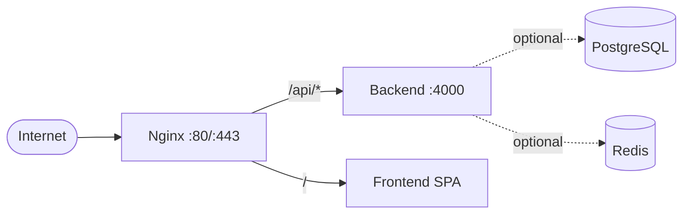

# Deployment Architecture

## High-level diagram



Text view:

```
                    [ Internet ]
                          |
                    [ Nginx :80/:443 ]
                          |
          +---------------+---------------+
          |                               |
    /api/* → backend:4000          / → frontend (SPA)
          |                               |
    [ Backend (Node) ]            [ Static assets ]
          |
    (optional) DB / Redis
```

## Environments

| Env | Purpose | How to run |
|-----|---------|------------|
| **Development** | Local dev | `npm run dev` (backend), `npx expo start --web` (frontend). No Docker required. |
| **Staging** | Pre-production | `docker compose up -d`. Uses `config/env/staging.env.example` (copy and set secrets). |
| **Production** | Live | Docker Compose or Kubernetes. Nginx reverse proxy, HTTPS. Secrets from vault/GitHub. |

## Components

- **Nginx:** Reverse proxy; routes `/api/*` to backend, `/` to frontend SPA. HTTPS via `deploy/nginx/ssl` and `conf.d/https.conf`.
- **Backend:** Express on port 4000. In-memory store by default; optional PostgreSQL/Redis when configured.
- **Frontend:** Static web build (`npx expo export --platform web`). Served by Nginx or by its own container in compose.
- **Database (optional):** PostgreSQL 16. Enable with `docker compose --profile with-db up -d`.
- **Redis (optional):** Session/cache. Enable with `docker compose --profile with-redis up -d`.

## Ports

- **80 / 443** – Nginx (public).
- **4000** – Backend (internal).
- **9090** – Prometheus (when using `docker-compose.monitoring.yml`).
- **3000** – Grafana (when using monitoring profile).

## Backward compatibility

- Backend runs without `DATABASE_URL` or `REDIS_URL`; `/health` and `/ready` remain 200 with checks skipped.
- Frontend build uses `EXPO_PUBLIC_API_URL`; in production set to the public API base (e.g. `https://mechnow.example.com/api`).
