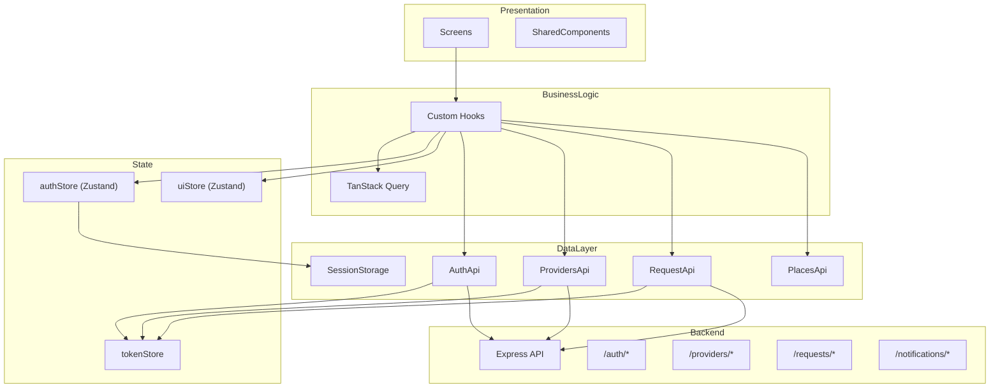
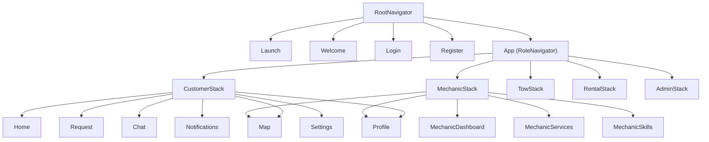
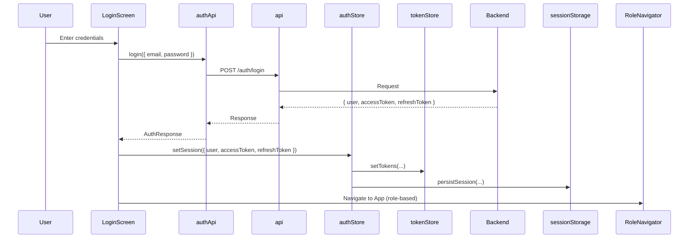
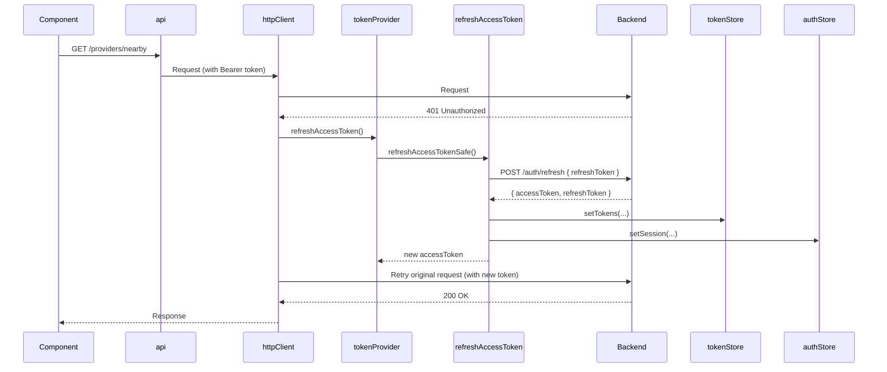

# Roadly – Technical Documentation

> Complete technical documentation for developers joining the project. This document describes the architecture, folder structure, API usage, state management, data flow, and mock vs real API areas.

---

## 1. Architecture Overview

The project follows **Clean Architecture** with a **feature-based folder structure**. There are clear boundaries between:

- **Presentation layer** – Screens, UI components, navigation
- **Business logic layer** – Custom hooks, use cases
- **Data layer** – API clients, repositories, storage

API calls live only in the data layer; components use hooks that consume data from APIs or mock sources.

### Architecture Diagram



### App Entry Flow

```mermaid
flowchart LR
    App["App.tsx"] --> Providers["AppProviders"]
    Providers --> ErrorBoundary["ErrorBoundary"]
    ErrorBoundary --> FontLoader["FontLoader"]
    FontLoader --> QueryClient["QueryClientProvider"]
    QueryClient --> SafeArea["SafeAreaProvider"]
    SafeArea --> BottomSheet["BottomSheetModalProvider"]
    BottomSheet --> NavContainer["NavigationContainer"]
    NavContainer --> AuthBootstrap["AuthBootstrap"]
    AuthBootstrap --> RootNavigator["RootNavigator"]
    RootNavigator --> RoleNavigator["RoleNavigator"]
```



### Navigation Flow



---

## 2. Folder Structure

### Root Layout

```
mechnow/
├── App.tsx                 # Entry point; renders AppProviders
├── app.json                # Expo config (name, slug, icons)
├── eas.json                # EAS Build config (development, preview, production)
├── package.json
├── .env.example
├── backend/                # Express Node.js API server
├── src/                    # React Native / Expo frontend
├── cypress/                # E2E tests (Cypress)
├── __tests__/              # Jest unit tests
└── docs/                   # Documentation
```

### Frontend `src/`

```
src/
├── features/               # Feature modules (one folder per feature)
│   ├── auth/
│   ├── map/
│   ├── providers/
│   ├── requests/
│   ├── mechanic/
│   ├── tow/
│   ├── rental/
│   ├── admin/
│   ├── profile/
│   ├── home/
│   ├── chat/
│   ├── notifications/
│   ├── settings/
│   └── location/
├── shared/                 # Shared components, services, theme, i18n
├── navigation/             # RootNavigator, RoleNavigator, role stacks
└── store/                  # Zustand stores
```

### Feature Module Layout

Each feature typically follows this structure:

```
features/<feature>/
├── data/                   # API layer (repositories)
│   └── <feature>Api.ts     # HTTP calls only; no UI
├── domain/                 # Types, interfaces (optional)
│   └── types.ts
├── hooks/                  # Business logic (use cases)
│   └── use<Feature>.ts     # TanStack Query or local state
├── presentation/           # UI
│   ├── screens/            # Screen components
│   └── components/         # Feature-specific components (optional)
└── utils/                  # Feature-specific utilities (optional)
```

### Shared `shared/`

```
shared/
├── components/             # Reusable UI (Button, Input, GlassCard, etc.)
├── constants/              # roles, apiEndpoints, env
├── i18n/                   # strings.ts, t()
├── providers/              # AppProviders, FontLoader, HttpEventsBinder, AuthBootstrap
├── services/
│   ├── auth/               # tokenStore, sessionStorage, refreshAccessToken
│   ├── http/               # api.ts, httpClient.ts, httpEvents.ts
│   ├── notifications/      # notificationCleanup
│   └── query/              # queryClient.ts
├── theme/                  # colors, typography, radii, shadows, roleThemes
├── types/                  # geo.ts, common.ts
└── utils/                  # eventBus
```

### Backend `backend/src/`

```
backend/src/
├── index.ts                # Express app, CORS, helmet, rate limit, routes
├── config/
│   └── env.ts              # Env validation (PORT, CLIENT_URL, JWT_*)
├── middleware/
│   ├── auth.ts             # Bearer JWT verification (authGuard)
│   ├── errorHandler.ts     # Global error handler
│   └── rateLimit.ts        # apiLimiter, authLimiter
├── routes/
│   ├── auth.ts             # /auth/register, /login, /refresh, /logout, /me
│   ├── providers.ts        # /providers/nearby, /:id, /me/location
│   ├── requests.ts         # /requests (POST, GET :id, PATCH :id/status)
│   ├── notifications.ts    # /notifications/register, /unregister
│   └── health.ts           # /health
├── services/
│   ├── password.ts         # bcrypt hash/verify
│   └── tokenService.ts     # JWT sign/verify
└── store/                  # In-memory stores (to be replaced by DB)
    ├── authStore.ts        # users, refresh tokens
    ├── providerStore.ts    # provider locations
    ├── requestStore.ts     # service requests
    └── tokenService.ts     # refresh token tracking
```

---

## 3. API Usage

### Backend Endpoints

| Method | Path | Auth | Description |
|--------|------|------|-------------|
| GET | `/health` | No | Health check `{ status: 'ok', timestamp }` |
| POST | `/auth/register` | No | Register; body: `{ name, email, password, role? }` |
| POST | `/auth/login` | No | Login; body: `{ email, password }` |
| POST | `/auth/refresh` | No | Refresh access token; body: `{ refreshToken }` |
| POST | `/auth/logout` | Optional | Logout; invalidates refresh token |
| GET | `/auth/me` | Yes | Current user |
| GET | `/providers/nearby` | Yes | Query: `lat`, `lng`, `radius?`, `role?`, `available?`, `page?`, `limit?` |
| GET | `/providers/:id` | Yes | Provider by id |
| PATCH | `/providers/me/location` | Yes | Body: `{ latitude, longitude }` |
| POST | `/requests` | Yes | Body: `{ serviceType, origin, destination? }` |
| GET | `/requests/:id` | Yes | Request by id (customer or provider) |
| PATCH | `/requests/:id/status` | Yes | Body: `{ status }` |
| POST | `/notifications/register` | Yes | Register push token |
| POST | `/notifications/unregister` | Yes | Unregister device |

**Note:** Backend uses in-memory stores; data is lost on restart. No `/admin/*` routes are implemented.

### Frontend API Layer

All HTTP calls go through the shared `api` client:

- **File:** `src/shared/services/http/api.ts`
- **Client:** Axios instance with base URL from `EXPO_PUBLIC_API_URL`
- **Auth:** Request interceptor adds `Authorization: Bearer <accessToken>`
- **401 handling:** Response interceptor retries once after refresh; on failure, calls `onUnauthorized` and emits `httpError`

**Data layer usage:**

| Feature | File | Endpoints Used |
|---------|------|----------------|
| Auth | `auth/data/authApi.ts` | `POST /auth/login`, `/auth/register`, `/auth/logout` |
| Providers | `providers/data/providersApi.ts` | `GET /providers/nearby`, `GET /providers/:id` |
| Requests | `requests/data/requestApi.ts` | `POST /requests`, `GET /requests/:id`, `PATCH /requests/:id/status` |
| Places | `map/data/placesApi.ts` | Google Places API (autocomplete; optional) |

**Refresh token:** Handled in `refreshAccessToken.ts`; calls `POST /auth/refresh` with `refreshToken` from `tokenStore`. No direct usage in feature APIs.

---

## 4. State Management

### Zustand Stores

| Store | Path | Purpose |
|-------|------|---------|
| **authStore** | `src/store/authStore.ts` | User, accessToken, refreshToken, isAuthenticated, hasHydrated; actions: setSession, clearSession, logout, hydrate |
| **uiStore** | `src/store/uiStore.ts` | loadingCount (global loader), toasts; actions: showLoader, hideLoader, toast, dismissToast |

### Token Store

| Store | Path | Purpose |
|-------|------|---------|
| **tokenStore** | `src/shared/services/auth/tokenStore.ts` | In-memory accessToken, refreshToken; used by httpClient for Authorization header and refresh flow |

### Session Persistence

- **sessionStorage.ts** – Persists `{ user, accessToken, refreshToken }` to AsyncStorage (web: localStorage)
- **hydrate** – On app start, `AuthBootstrap` calls `authStore.hydrate()` to load persisted session and optionally refresh access token

### TanStack Query

Used for **server state** (fetching from API):

| Hook | Query Key | API |
|------|-----------|-----|
| useNearbyProviders | `['providers', 'nearby', params]` | `fetchNearbyProviders` |
| useRequest | `['request', id]` | `getRequestById` |

**Rule:** Server state → TanStack Query; global UI state (auth, loader, toasts) → Zustand.

---

## 5. Data Flow

### Authentication Flow



### 401 + Refresh Flow



### Unauthorized Handling

- **httpEvents.emit('unauthorized')** – Fired when refresh fails or is not configured
- **UnauthorizedHandler** – Listens for `unauthorized`; clears session and navigates to Login

### Global Error Handling

- **httpEvents.emit('httpError')** – Fired on non-401 API errors
- **HttpEventsBinder** – Listens for `httpError`; shows toast with i18n message (Network, Timeout, Server, Unknown)

---

## 6. Mock vs Real API Areas

### Real API (Backend)

| Feature | Data Source | Notes |
|---------|-------------|-------|
| **Auth** | `authApi.ts` → `/auth/*` | Login, register, logout use real backend |
| **Providers** | `providersApi.ts` → `/providers/nearby`, `/providers/:id` | Map and provider list use real API when available |
| **Requests** | `requestApi.ts` → `/requests` | Create, get, update status use real backend |
| **Places** | `placesApi.ts` → Google Places | Autocomplete; returns `[]` if `EXPO_PUBLIC_GOOGLE_PLACES_KEY` not set |

### Mock / Stub

| Feature | Location | Description |
|---------|----------|-------------|
| **LoginScreen** | `handleMockLogin` | Role chips for quick test login (no backend) |
| **useMechanicDashboard** | `useMechanicDashboard.ts` | MOCK_JOBS, MOCK_REQUESTERS |
| **useTowDashboard** | `useTowDashboard.ts` | MOCK_JOBS, MOCK_REQUESTERS |
| **useRentalDashboard** | `useRentalDashboard.ts` | MOCK_VEHICLES, MOCK_BOOKINGS |
| **useAdminDashboard** | `useAdminDashboard.ts` | All panel data mock |
| **useAdminUsers** | `useAdminUsers.ts` | MOCK_USERS, MOCK_SERVICES |
| **useProviderProfile** | `useProviderProfile.ts` | Mock profile and services |
| **MechanicServicesScreen** | `MechanicServicesScreen.tsx` | MOCK_SERVICES |
| **MechanicSkillsScreen** | `MechanicSkillsScreen.tsx` | MOCK_SKILLS |
| **TowServicesScreen** | `TowServicesScreen.tsx` | MOCK_SERVICES |
| **TowSkillsScreen** | `TowSkillsScreen.tsx` | MOCK_SKILLS |
| **RentalServicesScreen** | `RentalServicesScreen.tsx` | MOCK_SERVICES |
| **RentalSkillsScreen** | `RentalSkillsScreen.tsx` | MOCK_SKILLS |
| **ChatScreen** | `ChatScreen.tsx` | MOCK_CHATS |
| **NotificationsScreen** | `NotificationsScreen.tsx` | MOCK_NOTIFICATIONS |
| **MapScreen.web** | `MapScreen.web.tsx` | Fallback to MOCK_PROVIDERS if API returns empty |
| **placesApi.fetchPlaceCoordinates** | `placesApi.ts` | Returns `null`; map search does not move to selected place |
| **useRealtimeProviders** | `useRealtimeProviders.ts` | Stub; returns useNearbyProviders data; no WebSocket |

### Backend In-Memory

- **authStore** – Users and refresh tokens in `Map`; lost on restart
- **providerStore** – Provider locations in memory
- **requestStore** – Service requests in memory
- **notificationStore** – Device tokens in memory

---

## 7. Environment Variables

### Frontend (.env)

| Variable | Required | Description |
|----------|----------|-------------|
| `EXPO_PUBLIC_API_URL` | Yes | Backend base URL (e.g. `http://localhost:4000`) |
| `EXPO_PUBLIC_ENVIRONMENT` | No | `development` \| `staging` \| `production` |
| `EXPO_PUBLIC_GOOGLE_MAPS_KEY` | For map | Google Maps JS SDK key (web) |
| `EXPO_PUBLIC_GOOGLE_PLACES_KEY` | For Places | Google Places API key (search) |

### Backend (.env)

| Variable | Required | Description |
|----------|----------|-------------|
| `CLIENT_URL` | Yes | CORS origin (e.g. `http://localhost:8081`) |
| `JWT_SECRET` | Yes | Access token secret |
| `JWT_REFRESH_SECRET` | Yes | Refresh token secret |
| `PORT` | No | Default 4000 |
| `NODE_ENV` | No | Default development |
| `BCRYPT_ROUNDS` | No | Default 12 |

---

## 8. Roles

| Role | Value | Navigation Stack |
|------|-------|------------------|
| User | `user` | CustomerStack |
| Mechanic | `mechanic` | MechanicStack |
| Mechanic + Tow | `mechanic_tow` | TowStack |
| Car Rental | `car_rental` | RentalStack |
| Admin | `admin` | AdminStack |

---

## 9. Key Files for Onboarding

| Purpose | File |
|---------|------|
| App entry | `App.tsx` → `AppProviders` |
| Root navigation | `navigation/RootNavigator.tsx` |
| Role-based navigation | `navigation/RoleNavigator.tsx` |
| Auth state | `store/authStore.ts` |
| HTTP client | `shared/services/http/api.ts`, `httpClient.ts` |
| API endpoints | `shared/constants/apiEndpoints.ts` |
| Theme | `shared/theme/` (colors, typography, roleThemes) |
| i18n | `shared/i18n/strings.ts`, `t()` |
| Backend entry | `backend/src/index.ts` |

---

## 10. Testing

- **Unit:** Jest in `__tests__/`
- **E2E:** Cypress in `cypress/e2e/` (auth, map, dashboards, admin, profile)
- **Run E2E:** `npx cypress open` (Expo web on port 8082)
- **Docs:** `docs/CYPRESS_E2E.md`

---

*Last updated: March 2025*
